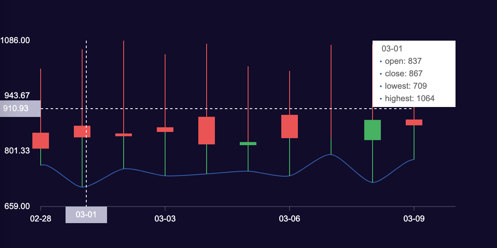
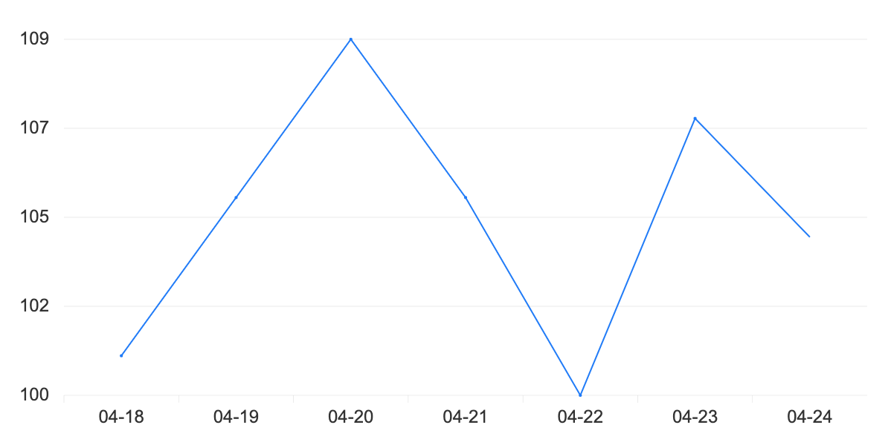
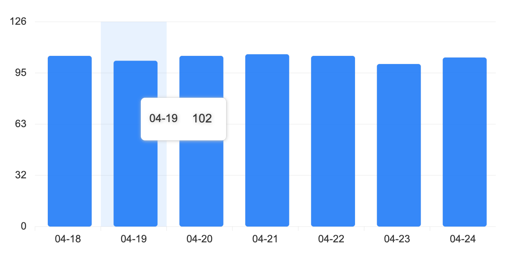

## KLine
效果图


代码演示
```jsx
import React from 'react';
import { KLine } from 'light-charts';

const App = () => {
  // 获取数据（注意返回格式）
  const getKLineData = function (param) {
    // mock数据
    function randn_bm() {
      var u = 0, v = 0;
      while(u === 0) u = Math.random();
      while(v === 0) v = Math.random();
      return Math.abs(Math.sqrt(-2.0 * Math.log(u)) * Math.cos(2.0 * Math.PI * v))
    }
    // mean 均值; stddev 差值
    const { pageSize = 10, endTime = '', mean = 500, stddev = 10 } = param
    return new Promise((resolved, rejected) => {
      setTimeout(resolved, 500, new Array(pageSize).fill({}).map((item, index) => {
        const openingPrice = Math.round(Math.max(0, mean + stddev * randn_bm()))
        const closingPrice = Math.round(Math.max(0, mean + stddev * randn_bm()))
        const highestPrice = Math.max(openingPrice, closingPrice) + Math.round(stddev/2 * randn_bm())
        const lowestPrice = Math.min(openingPrice, closingPrice) - Math.round(stddev/2 * randn_bm())

        return {
          id: Math.random().toString().slice(2, 7),
          date: moment(endTime).subtract(pageSize - index - 1, 'days').format('MM-DD'),
          openingPrice,
          closingPrice,
          highestPrice,
          lowestPrice,
        }
      }))
    })
  }

  return (
    <KLine
      option={{ pageSize: 30 }}
      loadData={getKLineData}
    />
  )
}
```

### api
| 属性 | 说明 | 类型 |  默认值  |
| ------ | ------ | ------ | ------ |
| option	| 配置项对象	| object	| -
| loadData	| 必填。请求数据的方法，返回数据约定为{id: number, date: string, highestPrice: number, lowestPrice: number, openingPrice: number, closingPrice: number}[]	| Promise | -
| style	| 元素宽高	| object	| { width: '600px', height: '300px' }

### option配置项
| 属性 | 说明 | 类型 |  默认值  |
| ------ | ------ | ------ | ------ |
| avgList	|平均线类型。可选值为 5 10 20	|array	|[5, 10, 20]
| showTips	|显示辅助线	|boolean	|true
| canDrag	|是否可拖拽	|boolean	|true
| canScroll	|是否可缩放	|boolean	|false
| pageSize	|一屏展示多少条	|number	|40
| maxShowSize	|一屏最多展示多少条	|number	|80
| yAxisSplitNumber	|y轴分段数量	|number	|4
| backgroundColor	|背景色	|string	|'#FFFFFF'
| xAxisItemMaxShowNumber	|x轴元素「文字和刻度」最大展示个数	|number	|5
| axisTick	|刻度相关。默认长度为5px，显示刻度	|object	|{ length: 5, show: true }
| grid	|grid对象	|object	| -

### grid配置项
| 属性 | 说明 | 类型 |  默认值  |
| ------ | ------ | ------ | ------ |
| left	|距离容器左侧的距离	|number	|30
| right	|距离容器右侧的距离	|number	|30
| top	|距离容器顶部的距离	|number	|20
| bottom	|距离容器底部的距离	|number	|20
| height	|grid组件的高度。想设置百分比的话，选择0-1，1表示100%	|string	|'auto'
| width	|grid组件的宽度。想设置百分比的话，选择0-1，1表示100%	|string	|'auto'


## Line
效果图


代码演示
```jsx
import React, { useEffect, useState } from 'react';
import { KLine } from 'light-charts';

const App = () => {
  const [lineData, setLineData] = useState([]);

  /**
   *
   * @param {Object} param 获取折线图接口数据
   * @returns
   */
  const getLineMockData = function () {
    return new Promise((resolved, rejected) => {
      setTimeout(resolved, 500, new Array(7).fill({}).map((item, index) => {
        return {
          date: moment().subtract(7 - index - 1, 'days').format('MM-DD'),
          value: +('10' + Math.random().toString().slice(2, 3)),
        }
      }))
    })
  }

  useEffect(() => {
    getLineMockData().then((res) => {
      const data = res || [];
      setLineData(data)
    })
  }, [])

  return (
    <Line
      option={{
        yData: lineData.map(x => x.value),
        xData: lineData.map(x => x.date),
      }}
      style={{ width: '600px', height: '300px' }}
    />
  )
}
```

### api
| 属性 | 说明 | 类型 |  默认值  |
| ------ | ------ | ------ | ------ |
| option	| 配置项对象	| object	| -
| style	| 元素宽高	| object	| { width: '600px', height: '300px' }

### option配置项
| 属性 | 说明 | 类型 |  默认值  |
| ------ | ------ | ------ | ------ |
| yData	|纵坐标数据	|number[]	|[]
| xData	|横坐标数据	|number[]	|[]
| yAxisSplitNumber	|y轴分段数量	|number	|5
| backgroundColor	|背景色	|string	|'#FFFFFF'
| axisTick	|刻度相关。默认长度为5px，显示刻度	|object	|{ length: 5, show: true }
| grid	|grid对象	|object	| -

### grid配置项
| 属性 | 说明 | 类型 |  默认值  |
| ------ | ------ | ------ | ------ |
| left	|距离容器左侧的距离	|number	|30
| right	|距离容器右侧的距离	|number	|30
| top	|距离容器顶部的距离	|number	|30
| bottom	|距离容器底部的距离	|number	|30
| height	|grid组件的高度。想设置百分比的话，选择0-1，1表示100%	|string	|'auto'
| width	|grid组件的宽度。想设置百分比的话，选择0-1，1表示100%	|string	|'auto'


## Bar
效果图


代码演示
```jsx
import React, { useEffect, useState } from 'react';
import { Bar } from 'light-charts';

const App = () => {
  const [barData, setBarData] = useState([]);

  /**
   *
   * @param {Object} param 获取柱状图接口数据
   * @returns
   */
  const getBarData = function () {
    return new Promise((resolved, rejected) => {
      setTimeout(resolved, 500, new Array(7).fill({}).map((item, index) => {
        return {
          date: moment().subtract(7 - index - 1, 'days').format('MM-DD'),
          value: +('10' + Math.random().toString().slice(2, 3)),
        }
      }))
    })
  }

  useEffect(() => {
    getBarData().then((res) => {
      const data = res || [];
      setBarData(data)
    })
  }, [])

  return (
    <Bar
      option={{
        yData: barData.map(x => x.value),
        xData: barData.map(x => x.date),
      }}
      style={{ width: '600px', height: '300px' }}
    />
  )
}
```

### api
| 属性 | 说明 | 类型 |  默认值  |
| ------ | ------ | ------ | ------ |
| option	| 配置项对象	| object	| -
| style	| 元素宽高	| object	| { width: '600px', height: '300px' }

### option配置项
| 属性 | 说明 | 类型 |  默认值  |
| ------ | ------ | ------ | ------ |
| yData	|纵坐标数据	|number[]	|[]
| xData	|横坐标数据	|string[]	|[]
| yAxisSplitNumber	|y轴分段数量	|number	|4
| backgroundColor	|背景色	|string	|'#FFFFFF'
| axisTick	|刻度相关。默认长度为5px，显示刻度	|object	|{ length: 5, show: true }
| grid	|grid对象	|object	| -


### grid配置项
| 属性 | 说明 | 类型 |  默认值  |
| ------ | ------ | ------ | ------ |
| left	|距离容器左侧的距离	|number	|30
| right	|距离容器右侧的距离	|number	|30
| top	|距离容器顶部的距离	|number	|30
| bottom	|距离容器底部的距离	|number	|30
| height	|grid组件的高度。想设置百分比的话，选择0-1，1表示100%	|string	|'auto'
| width	|grid组件的宽度。想设置百分比的话，选择0-1，1表示100%	|string	|'auto'